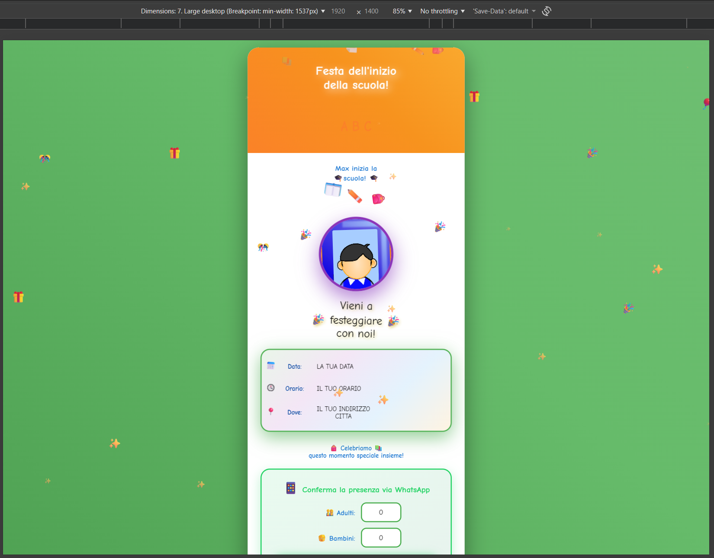
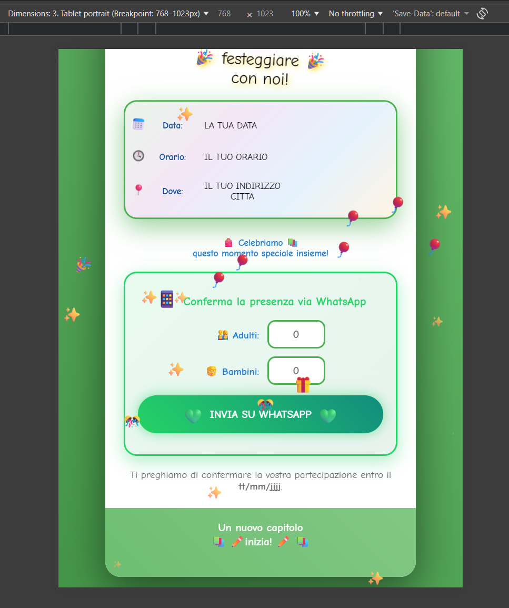
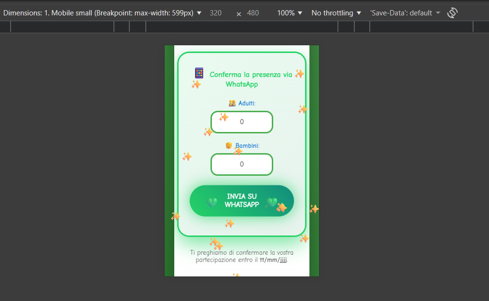

# 🎓 School Enrollment Invitation – Italian Interactive Website

A magical, interactive web invitation for Max's "Einschulung" (first day of school) celebration!  
This website combines playful design, smooth animations, and practical features like WhatsApp RSVP and a fully responsive layout.

---

## ✨ Main Features
- **Design & Animations:** Dynamic gradients, 3D effects, confetti, and school-themed decorations.
- **Interactivity:** WhatsApp attendance confirmation, input validation, click effects, and print optimization.
- **Special Elements:** Magic photo, animated event calendar, ABC decorations, and a festive footer.

---

## 📱 Previews

### Desktop + Magic Elements

### Tablet Portrait + Magic Elements

### Mobile Small + Magic Elements

---

## 🚀 Usage
1. **Clone or download the repository:**
git clone https://github.com/MihaelaAghirculesei/Invitation.git
python -m http.server 8000

text

2. **Customization:**
- Change the WhatsApp number in `script.js`
- Adjust event details in `index.html`
- Replace the photo in `img/foto-einschulung.png`

3. **Send the invitation:**
Host via GitHub Pages, Netlify, or Vercel – or print it as a PDF.

---

## 🛠️ Technologies
HTML5 · CSS3 (with animations & 3D transformations) · JavaScript (ES6)  
Google Fonts · WhatsApp API

---

## 📄 License
MIT License – free for personal use and adaptation.

---

Made with ❤️ for Max's first day of school – a new adventure begins! 📚✨